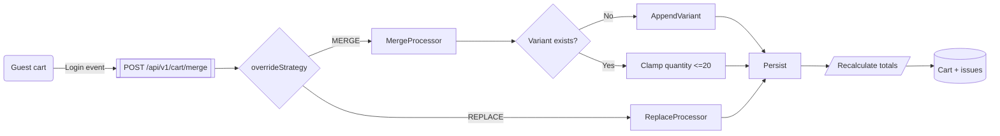

# Cart API

The Cart API maintains persistent carts for authenticated shoppers, applies inventory checks, and prepares payloads for checkout. Auth is mandatory for every route and responses include cart aggregations plus validation hints.

## Endpoints

| Method   | Path                          | Description                                                                           | Notes                                                        |
| -------- | ----------------------------- | ------------------------------------------------------------------------------------- | ------------------------------------------------------------ |
| `GET`    | `/api/v1/cart`                | Fetches the active cart for the authenticated user (or auto-creates on first access). | Cache busts on every write to guarantee fresh totals.        |
| `POST`   | `/api/v1/cart/items`          | Adds or upserts a line item.                                                          | Body: `{ productVariantId, quantity }` with max quantity 20. |
| `PUT`    | `/api/v1/cart/items/{itemId}` | Adjusts quantity; 0 is rejected with validation error.                                | Emits audit trail `cart.item.update`.                        |
| `DELETE` | `/api/v1/cart/items/{itemId}` | Removes a line item.                                                                  | Soft delete for forensic visibility.                         |
| `DELETE` | `/api/v1/cart`                | Clears the entire cart.                                                               | Invalidates Redis cache keys `cart:*`.                       |
| `POST`   | `/api/v1/cart/merge`          | Merges a guest cart (session-based) into the authenticated cart.                      | Supports `overrideStrategy` = `MERGE` or `REPLACE`.          |
| `GET`    | `/api/v1/cart/validate`       | Performs pre-checkout validation (stock, price drift, promotion applicability).       | Returns `{ cart, issues[] }`.                                |

Rate limit: 120 requests / 5 minutes per `userId` or IP. Headers `X-RateLimit-*` emitted on every response.

## Merge Flow



## Validation Response Example

```json
{
  "success": true,
  "data": {
    "cart": {
      "id": "clz25i3we0000yut8bxjrlzpq",
      "status": "ACTIVE",
      "items": [
        {
          "id": "clz25i3wl0002yut8hw4mqmy2",
          "productVariantId": "clz1f8og4000401t82n5kqhcv",
          "quantity": 2,
          "unitPrice": { "amount": 1499, "currency": "TRY" }
        }
      ],
      "totals": {
        "subtotal": { "amount": 2998, "currency": "TRY" },
        "tax": { "amount": 540, "currency": "TRY" },
        "discount": { "amount": 0, "currency": "TRY" },
        "total": { "amount": 3538, "currency": "TRY" }
      }
    },
    "issues": [
      {
        "code": "INSUFFICIENT_STOCK",
        "message": "Only 1 unit of HOODIE-AURORA-S-BLK remains.",
        "itemId": "clz25i3wl0002yut8hw4mqmy2"
      }
    ]
  },
  "meta": {
    "timestamp": "2025-01-12T10:05:10Z",
    "requestId": "94da2d45-8e01-4078-9d40-e4a356a4f142"
  }
}
```

## Error Handling

- Quantity outside `[1,20]` ⇒ `VALIDATION_ERROR` with field-level details.
- Unknown variant IDs ⇒ `NOT_FOUND`.
- Merge attempts with expired guest carts ⇒ `CART_NOT_FOUND`.

Always inspect `X-RateLimit-Remaining` to throttle UI polling. The OpenAPI contract in `packages/shared/src/api-schemas/openapi.yaml` mirrors these payloads.
