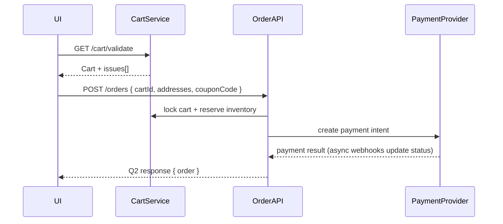
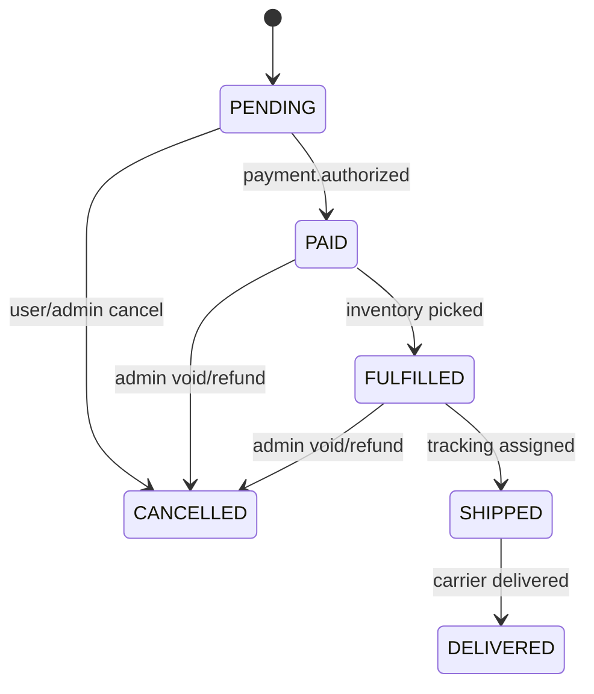

# Order API

The Order API orchestrates checkout, payment hand-off, fulfillment status changes, and admin workflows. All endpoints require authentication; admin variants enforce the `admin` role plus audit logging.

## Customer Endpoints

| Method                                 | Path                                                                                            | Description |
| -------------------------------------- | ----------------------------------------------------------------------------------------------- | ----------- |
| `POST /api/v1/orders`                  | Creates an order from the active cart, reserves inventory, and kicks off payment orchestration. |
| `GET /api/v1/orders`                   | Lists the customer's orders with pagination, optional `status` filter.                          |
| `GET /api/v1/orders/{id}`              | Returns a hydrated `OrderDetail` (addresses, items, payments, tracking).                        |
| `PUT /api/v1/orders/{id}/cancel`       | Cancels when status ∈ {`PENDING`, `PAID` but before fulfillment}.                               |
| `GET /api/v1/orders/{reference}/track` | Public tracking endpoint; no authentication required.                                           |

## Admin Endpoints

| Method                                  | Path                                                                                     | Purpose |
| --------------------------------------- | ---------------------------------------------------------------------------------------- | ------- |
| `GET /api/v1/admin/orders`              | Searchable paginated grid; supports filters `status`, `customerEmail`, `reference`.      |
| `GET /api/v1/admin/orders/stats`        | Returns key metrics (total orders, revenue, per-status counts, fulfillment latency P95). |
| `GET /api/v1/admin/orders/{id}`         | Deep dive view, including audit timeline and payment attempts.                           |
| `PUT /api/v1/admin/orders/{id}/status`  | Controlled transitions validated by the FSM below.                                       |
| `POST /api/v1/admin/orders/{id}/notes`  | Adds internal notes with actor metadata.                                                 |
| `POST /api/v1/admin/orders/{id}/refund` | Initiates provider refunds (supports partial and full).                                  |

Admin routes emit audit events such as `order.status.change` and `order.refund.requested`.

## Checkout Flow



## Status Lifecycle



Transitions outside the diagram return `422 UNPROCESSABLE_ENTITY`.

## Sample Responses

```json
{
  "success": true,
  "data": {
    "order": {
      "id": "clz2a0b6q0002xut8cl0v4zru",
      "reference": "ORD-2025-000245",
      "status": "PAID",
      "itemsCount": 2,
      "totalAmount": { "amount": 3538, "currency": "TRY" },
      "shippingAddress": {
        "id": "clz1f5z3d0001abcxyz",
        "fullName": "Ada Lovelace",
        "city": "Istanbul"
      },
      "timeline": [
        { "status": "PENDING", "timestamp": "2025-01-12T10:05:12Z" },
        { "status": "PAID", "timestamp": "2025-01-12T10:05:20Z" }
      ]
    }
  },
  "meta": {
    "timestamp": "2025-01-12T10:05:20Z",
    "requestId": "1c197b4d-8f77-4e75-b1d4-10ba4500c401"
  }
}
```

## Notes

- `POST /orders` requires a validated cart; stale prices produce `PRICE_CHANGED` errors referencing offending items.
- Refund requests create `order.refund.pending` audit entries until the payment provider callback finalises the state.
- Rate limits: customer routes share the global cart policy (60 req/5 min for order creation), admin analytics share 300 req/5 min.

Refer to the OpenAPI spec (`packages/shared/src/api-schemas/openapi.yaml`) for payload surfaces and Spectral-validated constraints.
