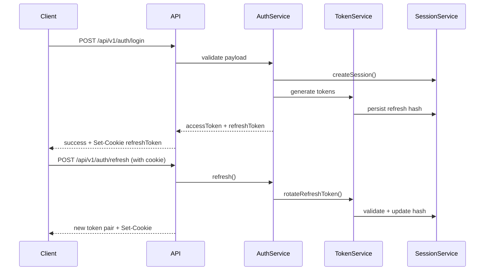

# Authentication Overview

This document explains the Lumi authentication stack delivered in Phase 3. Use it as the canonical
reference when integrating frontend, mobile, or partner systems with the backend.

## Architecture at a Glance

- **AuthService** orchestrates registration, login, verification, session rotation, and account
  security workflows.
- **TokenService** issues HS256 JWT access/refresh tokens, performs replay detection, and invokes
  `SessionService` for persistence.
- **SessionService** stores hashed refresh tokens, enforces fingerprint validation, and revokes
  sessions on logout, password resets, or suspicious activity.
- **RbacService** resolves role and permission assignments with Redis-backed caching (memory
  fallback) to keep permission checks below 50 ms.
- **SecurityEventService** records every sensitive transition (login success/failure, token reuse,
  admin access attempts) for observability.



## End-to-End Flow

1. **Register** – `POST /api/v1/auth/register`
   - Validates password policy (12+ chars, upper/lower/number/special).
   - Seeds default `customer` role and sends verification email.
2. **Verify email** – `POST /api/v1/auth/verify-email`
   - Token is a signed, bcrypt-hashed secret. Reuse triggers session revocation.
3. **Login** – `POST /api/v1/auth/login`
   - Applies brute-force delays and lockout policy before issuing tokens.
   - Returns access token (15 min TTL) and refresh token (14 day TTL) plus HTTP-only cookie.
4. **Access protected resources**
   - Attach `Authorization: Bearer <accessToken>` header.
   - RBAC enforced via `requireRole` / `requirePermission`.
5. **Refresh** – `POST /api/v1/auth/refresh`
   - Requires the signed refresh cookie. Rotates JTI, revokes old token, emits telemetry.
   - Replay attempts revoke every active session for the user.
6. **Logout** – `POST /api/v1/auth/logout` or `/logout-all`
   - Clears cookie, revokes session(s), records `logout`/`logout_all` events.
7. **Password recovery**
   - `POST /api/v1/auth/forgot-password` → send reset email.
   - `POST /api/v1/auth/reset-password` → reset, revoke sessions, emit `password_reset_completed`.

## Integration Checklist

| Client Responsibility | Recommendation                                                                                        |
| --------------------- | ----------------------------------------------------------------------------------------------------- |
| Persist tokens        | Store only the access token; rely on HTTP-only refresh cookie when possible.                          |
| Clock skew            | Account for ±2 minutes when evaluating expiry timestamps.                                             |
| Token refresh         | Refresh proactively when `< 60 s` of TTL remains; handle `401` by redirecting to login.               |
| Logout                | Always call the API endpoints rather than clearing local storage to guarantee server-side revocation. |
| PII storage           | Never cache user profile data beyond session scope; treat `AuthUserProfile` as sensitive.             |

### Web Applications

- Use `same-origin` requests so the refresh cookie travels automatically.
- On load, call `GET /api/v1/auth/me` to prime session context.
- Handle `401` responses globally (e.g. Axios interceptor) and redirect to login.

### Native / Mobile Clients

- Store the refresh token from the login response in the secure OS keychain.
- Send refresh token as a cookie header: `Cookie: refreshToken=<token>`.
- Clear tokens and keychain entries on logout or `TOKEN_REUSE_DETECTED`.

## Error Handling

- **Validation errors** (`400`) expose `error.details.issues` – render inline feedback.
- **Unauthorized** (`401`) includes a `details.reason` when available:
  - `invalid_credentials`
  - `account_inactive`
  - `session_expired`
  - `token_reuse_detected`
- **Conflict** (`409`) indicates a logical conflict (e.g. email already verified).
- **Too many requests** (`429`) includes `Retry-After` when enforced by the rate limiter.

## Supporting Flows

- **Email resend** – `POST /api/v1/auth/resend-verification` (auth required, throttled).
- **Change password** – `PUT /api/v1/auth/change-password`
  - Requires current password; revokes all other sessions.
- **Two-factor placeholders** – `/2fa/setup` & `/2fa/verify` return `NOT_IMPLEMENTED`.
  Use the provided metadata to feature-flag upcoming UI.

## Observability & Auditing

- Every auth request emits structured logs (`level`, `message`, `metadata`) via Winston.
- Security events flow through `SecurityEventService` with severity levels; ensure dashboards
  subscribe to:
  - `login_failed`, `login_success`
  - `refresh_token_reuse_detected`
  - `session_fingerprint_mismatch`
  - `admin_access_attempt`
- Metrics instrumentation (Prometheus) tracks login success rate, password reset count, and token
  rotation latency.

## Client Implementation Snippets

```ts
// Example refresh helper (frontend)
async function rotateTokens() {
  const response = await fetch("/api/v1/auth/refresh", {
    method: "POST",
    credentials: "include",
    headers: { Accept: "application/json" },
  });

  if (!response.ok) {
    throw new Error("Refresh failed");
  }

  const payload = await response.json();
  const { accessToken, accessTokenExpiresAt } = payload.data;
  tokenStore.set(accessToken, new Date(accessTokenExpiresAt));
}
```

Always keep the OpenAPI specification as the source of truth for field names and payload structures.
